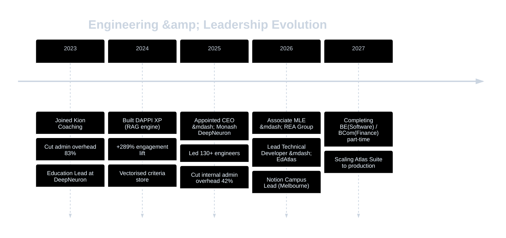

<!--
=================================================================================
  README — Justin Suan Thiha
  -----------------------------------------------------------------
  This file is hand-authored. Animated SVG assets live in /assets.
  Snake animation is generated daily by .github/workflows/snake.yml
  and served from the `output` branch.
=================================================================================
-->

<!-- ============================================================
     HERO  —  custom hand-authored animated SVG with dark/light variants
     ============================================================ -->

<picture>
  <source media="(prefers-color-scheme: dark)" srcset="./assets/hero-dark.svg">
  <source media="(prefers-color-scheme: light)" srcset="./assets/hero-light.svg">
  
</picture>

  
  &nbsp;
  
  &nbsp;
  
  &nbsp;
  
  &nbsp;
  

  

## Hello.

I'm **Justin** — an ML engineer and systems builder based in Melbourne. I currently wear two hats: **Associate MLE at [REA Group](https://rea-group.com)**, where I work on the recommendation models powering Australia's largest property platform, and **Lead Technical Developer at [EdAtlas](https://edatlas.com.au)**, where I architect and ship the tech that helps thousands of VCE students study smarter.

My thesis is simple: **engineering excellence is downstream of clear systems thinking.** Whether the system is a recommendation model, a multi-portal monorepo, or a 130-person organisation, the wins come from reducing friction and increasing signal-to-noise. Everything below is evidence of that thesis applied.

## What I'm building right now

> 🏠 &nbsp;**REA Group — Recommendation Models** &nbsp;·&nbsp; *Associate MLE*
> Working on the recommendation systems that surface the right listings to millions of Australians searching for a home. Production ML at scale.
>
> 🎓 &nbsp;**EdAtlas — Atlas Suite Platform** &nbsp;·&nbsp; *Lead Technical Developer*
> Architecting a multi-portal platform (Student / Parent / Tutor / Admin / CRM + marketing site) for Melbourne's fastest-growing VCE tutoring company. Stack: Turborepo + pnpm monorepo, Next.js with role-based route groups, Supabase + Drizzle ORM, Cloudflare Stream for video, Vidstack player.
>
> 🧠 &nbsp;**DAPPI XP** &nbsp;·&nbsp; *Personal R&D*
> RAG-based classification engine. Pipeline: ingestion → embedding → vectorised criteria store → retrieval-augmented scoring. Lifted user engagement **+289%** in production.

## Impact, in three numbers

Each tile is shipped production work — not a side project, not a proof of concept. The arc below shows how I got here.

## The arsenal

  

<table align="center">
<tr>
<td valign="top" width="33%">

**🧠 ML & Data**

Recommendation systems · Deep learning · RAG pipelines · Vector databases · Embeddings · Classification · pandas · NumPy · scikit-learn · TensorFlow

</td>
<td valign="top" width="33%">

**⚙️ Product Engineering**

Next.js · TypeScript · Supabase · Drizzle ORM · Turborepo · FastAPI · PostgreSQL · Cloudflare Stream · Docker · AWS

</td>
<td valign="top" width="33%">

**🏛️ Systems & Ops**

Monorepo architecture · Design systems · Workflow automation · Team scaling · Communication frameworks (CLAPS)

</td>
</tr>
</table>

## Live signal

  <a href="https://github.com/justin-thiha">
    <picture>
      <source media="(prefers-color-scheme: dark)" srcset="https://github-readme-stats.vercel.app/api?username=justin-thiha&show_icons=true&hide_border=true&title_color=5ce1e6&icon_color=a78bfa&text_color=cbd5e1&bg_color=0d1f3a">
      <source media="(prefers-color-scheme: light)" srcset="https://github-readme-stats.vercel.app/api?username=justin-thiha&show_icons=true&hide_border=true&title_color=006DAE&icon_color=7c3aed&text_color=0f172a&bg_color=f8fafc">
      
    </picture>
  </a>
  &nbsp;
  <a href="https://github.com/justin-thiha">
    <picture>
      <source media="(prefers-color-scheme: dark)" srcset="https://github-readme-streak-stats.herokuapp.com?user=justin-thiha&hide_border=true&background=0d1f3a&stroke=5ce1e6&ring=a78bfa&fire=a78bfa&currStreakLabel=5ce1e6&currStreakNum=cbd5e1&sideNums=cbd5e1&sideLabels=cbd5e1&dates=94a3b8">
      <source media="(prefers-color-scheme: light)" srcset="https://github-readme-streak-stats.herokuapp.com?user=justin-thiha&hide_border=true&background=f8fafc&stroke=006DAE&ring=7c3aed&fire=7c3aed&currStreakLabel=006DAE">
      
    </picture>
  </a>

  <picture>
    <source media="(prefers-color-scheme: dark)" srcset="https://github-readme-stats.vercel.app/api/top-langs/?username=justin-thiha&layout=compact&hide_border=true&title_color=5ce1e6&text_color=cbd5e1&bg_color=0d1f3a&langs_count=8">
    <source media="(prefers-color-scheme: light)" srcset="https://github-readme-stats.vercel.app/api/top-langs/?username=justin-thiha&layout=compact&hide_border=true&title_color=006DAE&text_color=0f172a&bg_color=f8fafc&langs_count=8">
    
  </picture>

### Eating my way through the contribution graph

<picture>
  <source media="(prefers-color-scheme: dark)" srcset="https://raw.githubusercontent.com/justin-thiha/justin-thiha/output/snake-dark.svg">
  <source media="(prefers-color-scheme: light)" srcset="https://raw.githubusercontent.com/justin-thiha/justin-thiha/output/snake.svg">
  
</picture>

↑ generated daily by a GitHub Action. The snake's been busy.

## The arc, year by year

## Past lives that built me

Before REA and EdAtlas, two roles shaped how I think:

> 🏛️ **CEO, Monash DeepNeuron** &nbsp;·&nbsp; *2025*
> Led Australia's largest student-led AI organisation — 130+ engineers, researchers, and creatives. Directed strategy, ran statewide hackathons (VicHack, 400+ participants), reduced internal admin overhead **42%** through workflow design. Stepped down to focus on industry ML.
>
> 📚 **Notion Campus Lead, Melbourne** &nbsp;·&nbsp; *ongoing*
> Driving Notion adoption across Monash's student engineering community.

## My operating system

A short bookshelf. Engineering and leadership both reward studying the people who got there first.

| Book | Author | The takeaway I apply |
|------|--------|-----------------------|
| **Atomic Habits** | James Clear | *You fall to the level of your systems.* Why I optimise the workflow, not the willpower. |
| **The Diary of a CEO** | Steven Bartlett | The Five Buckets, in order. A framework for managing energy through fast role transitions. |
| **Leaders Eat Last** | Simon Sinek | The Circle of Safety. Learned managing a 130-person volunteer org; applies just as much to engineering teams. |
| **Think Again** | Adam Grant | Debugging your priors. The same loop whether the bug is in a model or a meeting. |
| **Indistractable** | Nir Eyal | Time-blocking and traction over distraction. Essential when you're holding two roles + part-time uni. |
| **$100M Offers** | Alex Hormozi | The Value Equation. Engineering is worthless without a problem worth solving. |

## Let's talk

I'm not actively looking, but I'm always happy to swap notes with people working on:

- **Recommendation systems** &mdash; ranking, retrieval, two-tower models, candidate generation
- **EdTech architecture** &mdash; multi-portal platforms, content delivery, video at scale
- **Student engineering communities** &mdash; running them, scaling them, transitioning leadership

Reach out if any of that overlaps with your work.

  
  &nbsp;
  

  
    <i>"You do not rise to the level of your goals. You fall to the level of your systems."</i> 
    © 2026 Justin Suan Thiha &nbsp;·&nbsp; built in Melbourne &nbsp;·&nbsp; hand-authored SVGs in <code>/assets</code>
  

