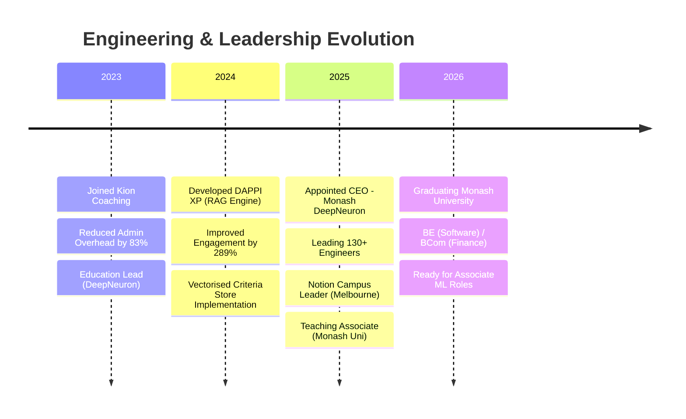

  

  <h3>
    <i>"I build systems that empower engineering teams to scale."</i>
  </h3>

---

### 👨‍💻 Who I Am

I am an **Associate Machine Learning Engineer** and **Systems Architect** driven by the convergence of technical innovation and human-centric design. My work operates at the intersection of Deep Learning, Retrieval-Augmented Generation (RAG), and Organizational Leadership.

Currently serving as the **CEO of Monash DeepNeuron**, I lead a diverse team of **130+ engineers**, researchers, and creatives. My philosophy is rooted in **Systems Thinking**—whether optimizing a neural network or scaling a student organization, the secret lies in reducing friction and maximizing the signal-to-noise ratio.

My technical focus is on building RAG-based classification systems (like the **DAPPI XP** engine) that bring intelligence to unstructured data. My leadership focus is on automating operational workflows to allow teams to focus on high-value creative work.

---

### 🔭 Current Focus

* **Engineering:** Scaling administrative automation platforms and RAG-based classification engines using **TensorFlow** and **Vector Databases**.
* **Leadership:** Directing strategy for **Monash DeepNeuron** and serving as the **Notion Campus Lead** for Melbourne.
* **Learning:** Advanced Multimodal Computer Vision pipelines and Behaviour Modelling.
* **Philosophy:** Exploring the intersection of Communication Frameworks (CLAPS) and Servant Leadership.

---

### 🛠 Technical Arsenal

 

 

 

---

### 🏆 Career & Leadership Velocity

### 🚀 High-Impact Metrics Dashboard

| **Kion Coaching** | **Monash DeepNeuron** | **DAPPI XP Engine** |
| --- | --- | --- |
| 📉 **83%** | 📉 **42%** | 📈 **289%** |
| Reduction in Operational Friction via Database Modelling & Automation | Reduction in Internal Admin Overhead via Workflow Optimization | Improvement in User Engagement via RAG-Based Classification |
| *Scaled business capacity from 4 to 27 active students* | *Managed & led statewide hackathons (VicHack) with 400+ participants* | *Delivered end-to-end ML workflow (Ingestion -> Embedding -> Retrieval)* |

---

### 📚 My Library: The Principles That Guide Me

I believe that engineering excellence is downstream of clear thinking and strong leadership. These are the texts that shape my operating system.

<table align="center">
<tr>
<td align="center" width="33%">

 
<b>Atomic Habits</b>
 
<i>James Clear</i>
 
 
"You do not rise to the level of your goals. You fall to the level of your systems."
 

</td>
<td align="center" width="33%">

 
<b>The Diary of a CEO</b>
 
<i>Steven Bartlett</i>
 
 
"Law 1: Fill your buckets in the right order." A masterclass in resilience & strategy.
 

</td>
<td align="center" width="33%">

 
<b>Leaders Eat Last</b>
 
<i>Simon Sinek</i>
 
 
Building the 'Circle of Safety'. Essential for managing large teams (130+).
 

</td>
</tr>
<tr>
<td align="center" width="33%">

 
<b>Think Again</b>
 
<i>Adam Grant</i>
 
 
The power of knowing what you don't know—essential for debugging models & teams.
 

</td>
<td align="center" width="33%">

 
<b>Indistractable</b>
 
<i>Nir Eyal</i>
 
 
Mastering attention management in an age of digital noise.
 

</td>
<td align="center" width="33%">

 
<b>$100M Offers</b>
 
<i>Alex Hormozi</i>
 
 
Engineering is worthless if it doesn't solve a valuable problem. The Value Equation.
 

</td>
</tr>
</table>

---

© 2026 Justin Suan Thiha

