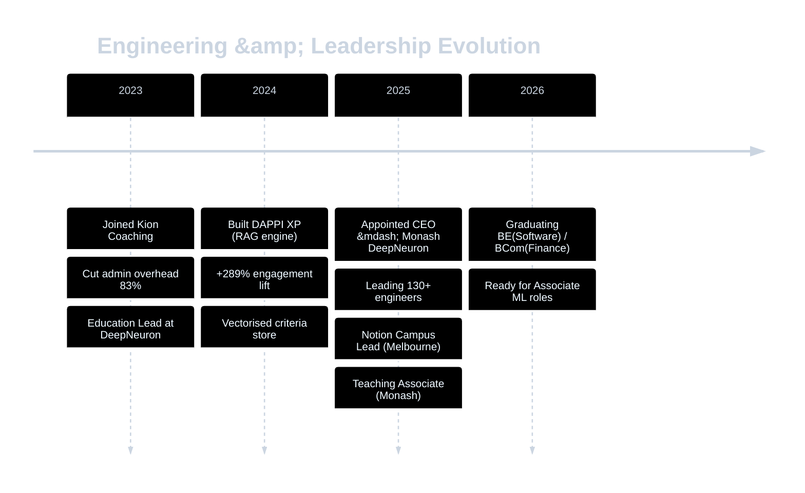

<!--
=================================================================================
  README — Justin Suan Thiha
  -----------------------------------------------------------------
  This file is hand-authored. Animated SVG assets live in /assets.
  Snake animation is generated daily by .github/workflows/snake.yml
  and served from the `output` branch.
=================================================================================
-->

<!-- ============================================================
     HERO  —  custom hand-authored animated SVG with dark/light variants
     ============================================================ -->

<picture>
  <source media="(prefers-color-scheme: dark)" srcset="./assets/hero-dark.svg">
  <source media="(prefers-color-scheme: light)" srcset="./assets/hero-light.svg">
  
</picture>

  
  &nbsp;
  
  &nbsp;
  
  &nbsp;
  

  

## Hello.

I'm **Justin** — a builder operating at the intersection of **machine learning**, **systems design**, and **organisational leadership**. By day I lead a team of 130+ engineers, researchers, and creatives as CEO of [Monash DeepNeuron](https://monashdeepneuron.com), Australia's largest student-led AI organisation. By night (and most other times) I build **RAG-based classification engines**, **internal automation platforms**, and the occasional contribution graph snake.

My thesis is simple: **engineering excellence is downstream of clear systems thinking.** Whether the system is a neural net or a 130-person org, the wins come from reducing friction and increasing signal-to-noise. Everything below is evidence of that thesis applied.

## Impact, in three numbers

Each tile is shipped production work — not a side project, not a proof of concept. Drill down in the timeline below.

## What I'm building right now

> 🧠 &nbsp;**DAPPI XP** — a RAG-based classification engine for unstructured data. Pipeline: ingestion → embedding → vectorised criteria store → retrieval-augmented scoring. Lifted user engagement **+289%**.
>
> 🏛️ &nbsp;**Monash DeepNeuron** — directing strategy and operations for 130+ engineers. Recently ran statewide hackathons (VicHack, 400+ participants) and reduced internal admin overhead **42%** through workflow automation.
>
> 📚 &nbsp;**Notion Campus Lead, Melbourne** — driving Notion adoption across Monash's student engineering community.
>
> 🎓 &nbsp;**Teaching Associate, Monash University** — preparing for graduation (BE Software / BCom Finance) and an Associate ML Engineer role for 2026.

## The arsenal

  

<table align="center">
<tr>
<td valign="top" width="33%">

**🧠 ML & Data**

Deep learning · RAG pipelines · Vector databases · Embeddings · Classification systems · pandas · NumPy · scikit-learn

</td>
<td valign="top" width="33%">

**⚙️ Engineering**

Python · SQL · Java · FastAPI · PostgreSQL · Docker · AWS · Git · CI/CD

</td>
<td valign="top" width="33%">

**🏛️ Systems & Ops**

Notion (Campus Lead) · Workflow design · Database modelling · Team scaling · Communication frameworks (CLAPS)

</td>
</tr>
</table>

## Live signal

  <a href="https://github.com/justinthiha">
    <picture>
      <source media="(prefers-color-scheme: dark)" srcset="https://github-readme-stats.vercel.app/api?username=justinthiha&show_icons=true&hide_border=true&title_color=5ce1e6&icon_color=a78bfa&text_color=cbd5e1&bg_color=0d1f3a">
      <source media="(prefers-color-scheme: light)" srcset="https://github-readme-stats.vercel.app/api?username=justinthiha&show_icons=true&hide_border=true&title_color=006DAE&icon_color=7c3aed&text_color=0f172a&bg_color=f8fafc">
      
    </picture>
  </a>
  &nbsp;
  <a href="https://github.com/justinthiha">
    <picture>
      <source media="(prefers-color-scheme: dark)" srcset="https://github-readme-streak-stats.herokuapp.com?user=justinthiha&hide_border=true&background=0d1f3a&stroke=5ce1e6&ring=a78bfa&fire=a78bfa&currStreakLabel=5ce1e6&currStreakNum=cbd5e1&sideNums=cbd5e1&sideLabels=cbd5e1&dates=94a3b8">
      <source media="(prefers-color-scheme: light)" srcset="https://github-readme-streak-stats.herokuapp.com?user=justinthiha&hide_border=true&background=f8fafc&stroke=006DAE&ring=7c3aed&fire=7c3aed&currStreakLabel=006DAE">
      
    </picture>
  </a>

  <picture>
    <source media="(prefers-color-scheme: dark)" srcset="https://github-readme-stats.vercel.app/api/top-langs/?username=justinthiha&layout=compact&hide_border=true&title_color=5ce1e6&text_color=cbd5e1&bg_color=0d1f3a&langs_count=8">
    <source media="(prefers-color-scheme: light)" srcset="https://github-readme-stats.vercel.app/api/top-langs/?username=justinthiha&layout=compact&hide_border=true&title_color=006DAE&text_color=0f172a&bg_color=f8fafc&langs_count=8">
    
  </picture>

### Eating my way through the contribution graph

<picture>
  <source media="(prefers-color-scheme: dark)" srcset="https://raw.githubusercontent.com/justinthiha/justinthiha/output/snake-dark.svg">
  <source media="(prefers-color-scheme: light)" srcset="https://raw.githubusercontent.com/justinthiha/justinthiha/output/snake.svg">
  
</picture>

↑ generated daily by a GitHub Action. The snake's been busy.

## The arc, year by year

## My operating system

A short bookshelf. Engineering and leadership both reward studying the people who got there first.

| Book | Author | The takeaway I apply |
|------|--------|-----------------------|
| **Atomic Habits** | James Clear | *You fall to the level of your systems.* Why I optimise the workflow, not the willpower. |
| **The Diary of a CEO** | Steven Bartlett | The Five Buckets, in order. A framework for managing energy as a 22-year-old CEO. |
| **Leaders Eat Last** | Simon Sinek | The Circle of Safety. Non-negotiable for managing a 130-person volunteer org. |
| **Think Again** | Adam Grant | Debugging your priors. The same loop whether the bug is in a model or a meeting. |
| **Indistractable** | Nir Eyal | Time-blocking and traction over distraction. The work-week is a system too. |
| **$100M Offers** | Alex Hormozi | The Value Equation. Engineering is worthless without a problem worth solving. |

## Let's talk

I'm actively looking for **Associate Machine Learning Engineer** opportunities for 2026 — particularly teams working on RAG, classification systems, or production ML infrastructure. I'm also open to founder conversations, advisory chats on student engineering communities, and anyone wanting to swap notes on running large volunteer organisations.

  
  &nbsp;
  

  
    <i>"You do not rise to the level of your goals. You fall to the level of your systems."</i> 
    © 2026 Justin Suan Thiha &nbsp;·&nbsp; built in Melbourne &nbsp;·&nbsp; hand-authored SVGs in <code>/assets</code>
  

